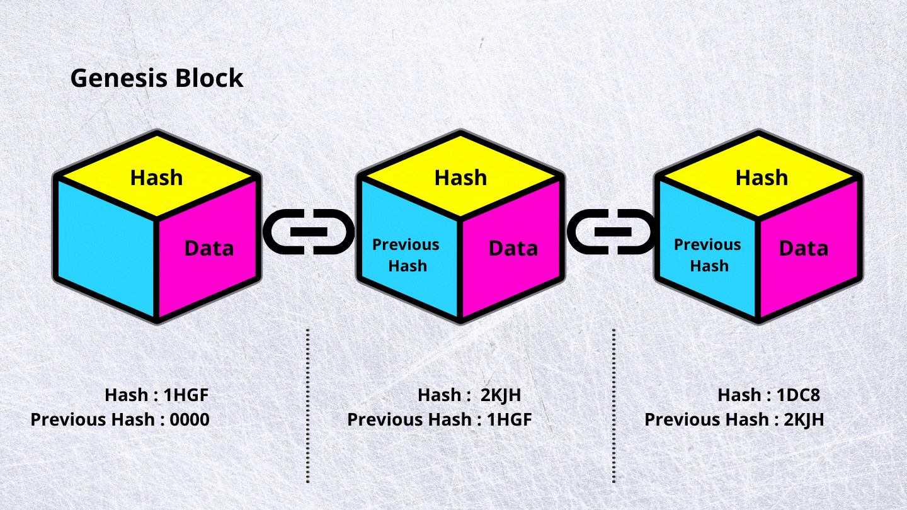
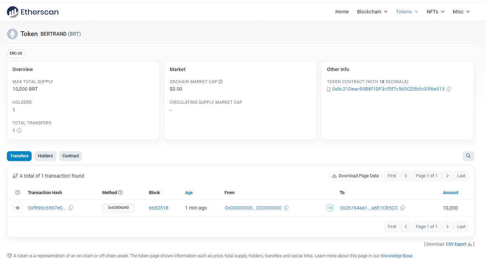
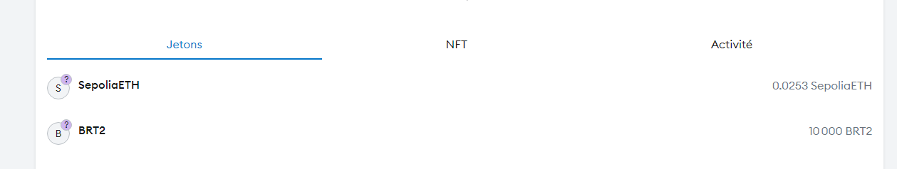

# Blockchain et Développement

But : Développer une application décentralisée 

3 notes : 
- Examen théorique
- Projet
- Prise de note

## Fonction de hashage 

Une fonction de hashage cryptographique est une fonction pure et déterministe qui prend en entrée un message de taille arbitraire et qui produit en sortie en ensemble de taille fixe. Ces sorties sont généralement appelées hash ou digest de l'entrée. 

- Determinisme : Pour une entrée donnée, la sortie est toujours la même. 
- Vitesse : Quelques secondes pour calculer le hash d'un message. 
- Résistance aux collisions : Il devrait être difficile de trouver deux messages différents qui produisent le même hash. 
- Non inversible : Une fonction de hashage ne doit pas pouvoir être inversée pour retrouver le message d'origine à partir du hash. 

## Rappel sur la cryptographie asymétrique

La cryptographie asymétrique est un système de chiffrement qui utilise une `paire de clés (privée, publique)` pour chiffrer et déchiffrer des messages.

Concrètement ça permet que personne ne puisse envoyer de message en notre nom, et que personne ne puisse lire les messages qui nous sont destinés.

Dans les faits c'est comme une grande base de données où tout est accessible à tout le monde, mais où personne ne peut modifier les données sauf si elles sont signées par une clé privée.

Ce sont des `signatures numériques` : c'est un hash signé avec une clé privée.

La clé publique permet de vérifier la signature, mais pas de la générer.

## La blockchain

La blockchain est une technologie de stockage et de transmission d'informations, transparente, sécurisée, et fonctionnant sans organe central de contrôle.

La blockchain est un registre numérique publique indélébile et décentralisé : 
- Indélébile : Les données ne peuvent pas être supprimées ou modifiées, on peut juste écrire.
- Décentralisé : Chacun des noeuds concentre l'intégralité des données.
- Distribué : La totalité des données sont stockées sur de multiples serveurs. 

Chacun des noeuds contient l'historique de toutes les transactions de chacun des noeuds.

Exemple : Git, Torrent, etc. 

A noter qu'il n'y a aucune autorité de contrôle sur la blockchain, c'est un `système décentralisé auto-géré`.

Un bloc est limité en taille, mais peut contenir n'importe quel type de données (monnaies, code exécutable, medias, etc). 

A noter que la performance de la blockchain a un coût, et que la blockchain est un système où tout le monde peut contribuer à la blockchain en allouant de la puissance de calcul. 

Processus de validation = minage. 

Le coup de gestion des changements au sein d'une blockchain étant élevé, toutes les transactions nécessitent le paiement d'une taxe. Cette taxe est généralement payée en cryptomonnaie relative à la blockchain (comme le bitcoin dans le réseau Bitcoin).

L'objectif de cette taxe est d'empêcher les attaquants de spammer le réseau pour le saturer.

### Une chaine de hash 



Une blockchain est une chaine de hash. Chaque bloc contient un hash du bloc précédent.
Donc un changement de hash dans un bloc entraine un changement de hash dans tous les blocs suivants.

Concrètement le hash est un moyen de vérifier l'intégrité des données. Le système est donc fait pour s'auto-gérer pour éviter ce genre de problème.

### Méthode de consensus

Consensus : Toutes les blockchain ont un algorithm de consensus qui décide si oui ou non une chaine de données sera intégrée au prochain bloc. 

Par exemple : Un vendeur propose un bien sur la blockchain et deux acheteurs veulent l'acheter. Comment le réseau peut-il décider qui a acheté en premier ? 
Pire, comment empêcher de dire au vendeur que les deux ont acheté le bien et d'encaisser deux fois ?

Le but est de trouver un moyen de déterminer comment les transactions sont choisies et ordonnées afin d'avoir un seul état de la blockchain. 
En d'autres termes, il faut trouver un moyen d'`établir un consensus sur les blocs qui sont ajoutés à la chaine`. 

#### Algorithme proof of work : 

Beaucoup de blockchains publiques comme Bitcoin ou Ethereum utilisent cet algorithme de consensus connu sous le nom de `proof of work`. Une preuve de travail c'est une preuve cryptographique que la transaction a bien été validée. Les noeuds qui remplissent ce rôle sont appelés les `mineurs`.

Concrètement le premier mineur qui va arrivé à trouver la preuve de travail va pouvoir ajouter le bloc à la blockchain.

Ce mécanisme est assez simple, l'identifiant de chaque bloc dans la chaine est un hash qui inclut l'identifiant du bloc précédent, toutes les transactions du bloc et un `nonce`. Donc pour ajouter un bloc à la chaine, il faut trouver un hash qui commence par un certain nombre de zéros.
Comme il n'est pas possible de prédir à quoi ressemblera un hash, un mineur ne peut que tenter de cacluler le hash du bloc en modifiant la valeur du nonce jusqu'à ce qu'il obtienne un hash qui corresponde aux critères du futur bloc.

Sachant que le nonce n'est pas fixe, il faut le rechercher pour chaque bloc. C'est là que les mineurs entrent en courses pour résoudre le puzzle. 

## Bitcoin 

### Présentation 

Jusqu'à maintenant, nous avons décrit la blockchain en tant que base de données publique, mais nous n'avons pas encore parlé de ce que nous pouvons y stocker.

Bitcoin : première application de la blockchain.

Bitcoin est une monnaie numérique qui permet de faire des transactions sans passer par une banque, sans autorité de contrôle. 

Voir pdf pour plus de détails.

## Ethereum

### Présentation

Ethereum est une plateforme open-source de blockchain qui permet de créer des contrats intelligents (smart contracts). Elle a été présdentée en 2013 et lancée en 2015 par Vitalik Buterin.

Sa principale particularité est la possibilité d'y `déployer du code qui pourra être exécuté dans la blockchain sous forme de smart contracts`.

Un smart contract est un court programme écrit dans la blockchain lors d'une transaction et qui peuvent réagir aux transactions qui lui sont envoyées en exécutant une logique arbitraire. Chaque smart contract a également son propre état arbitraire qui peut être mis à jour sur n'importe quelle transaction et peut contenir n'importe quelle donnée. 

Au début, la méthode de consensus était le proof of work, comme le bitcoin. Mais en 2017, Ethereum a commencé à migrer vers un algorithme de consensus appelé `proof of stake`.

### Pratique

Hot Wallet : Portefeuille en ligne
Cold Wallet : Portefeuille hors ligne

EtherScan : 
Cela permet de voir les transactions sur la blockchain Ethereum.
On peut voir les transactions, les contrats, les comptes, etc avec leur hash.

Un compte sert à stocker des ethers.

Le Gas est une unité de mesure de la puissance de calcul nécessaire pour exécuter une transaction ou un contrat. Elle est inscrite en Gwei soit Giga wei. (10^-18 ether)


Réseau de test : https://sepolia.etherscan.io/

#### Explication code tutoriel 

##### Commandes npx 

`npx` est un outil qui permet d'exécuter des commandes npm sans avoir à les installer localement.

`npx hardhat init` : Initialise un projet Hardhat
`npx hardhat compile` : Compile le code
`npx hardhat test` : Exécute les tests
`npx hardhat ignition deploy` : Déploie le contrat en local 
`npx hardhat ignition deploy --network <nom réseau>` : Déploie le contrat sur le réseau spécifié


##### Tests
Voir tutoriel : https://hardhat.org/tutorial/testing-contracts


Code complet : 
```js
const { expect } = require("chai");

describe("Token contract", function () {
  it("Deployment should assign the total supply of tokens to the owner", async function () {
    const [owner] = await ethers.getSigners();

    const hardhatToken = await ethers.deployContract("Token");

    const ownerBalance = await hardhatToken.balanceOf(owner.address);
    expect(await hardhatToken.totalSupply()).to.equal(ownerBalance);
  });
});
```

```js
const [owner] = await ethers.getSigners();
```
Un `signer` dans ethers.js est une entité qui représente un compte. Il est utilisé pour envoyer des transactions à des contrats et à d'autres comptes. Ici, nous obtenons une liste des comptes du nœud auquel nous sommes connectés, qui dans ce cas est Hardhat Network, et nous ne gardons que le premier.
(https://docs.ethers.org/v6/api/providers/#Signer) 

```js	
const hardhatToken = await ethers.deployContract("Token");
```

Nous déployons le contrat Token sur le réseau. La fonction deployContract prend le nom du contrat à déployer et les arguments du constructeur du contrat. Ici, nous n'avons pas besoin de passer d'arguments car le constructeur de Token n'en prend pas.

```js
const ownerBalance = await hardhatToken.balanceOf(owner.address);
```

Nous vérifions que le propriétaire a reçu la totalité de l'approvisionnement en jetons. Pour ce faire, nous appelons la fonction balanceOf du contrat Token avec l'adresse du propriétaire en tant qu'argument. Cette fonction renvoie le solde du propriétaire.

```js
expect(await hardhatToken.totalSupply()).to.equal(ownerBalance);
```

Nous vérifions que le solde du propriétaire est égal à l'approvisionnement total en jetons. Pour ce faire, nous appelons la fonction totalSupply du contrat Token, qui renvoie l'approvisionnement total en jetons, et nous vérifions qu'elle est égale au solde du propriétaire.

Ether.js : 

Une bibliothèque JavaScript qui permet d'interagir avec les contrats et les comptes Ethereum. Elle fournit une API simple et puissante pour envoyer des transactions, déployer des contrats, lire des données de la blockchain, etc.

Avec elle on peut communiquer avec Metamask directement depuis le navigateur.

Exercice : 

Décrire la structure d'un contrat déjà déployé sur la blockchain Ethereum. 

# ERC20 

ERC20 est un standard de contrat intelligent sur la blockchain Ethereum. Il définit un ensemble de règles que les contrats intelligents doivent suivre pour permettre l'émission et le transfert de jetons.

## Créer son Token ERC20

Code : 
```js
// SPDX-License-Identifier: Unlicense
pragma solidity ^0.8.20;

import "@openzeppelin/contracts/token/ERC20/ERC20.sol";

contract BERTRAND is ERC20 {
    constructor() ERC20("BERTRAND", "BRT") {
        _mint(msg.sender, 10000*10**18);
    }
}
```

- `pragma solidity ^0.8.20;` : Indique la version du compilateur Solidity à utiliser.
- `import "@openzeppelin/contracts/token/ERC20/ERC20.sol";` : Importe le contrat ERC20 d'OpenZeppelin.
- `contract BERTRAND is ERC20` : Déclare un contrat nommé BERTRAND qui hérite du contrat ERC20.
- `constructor() ERC20("BERTRAND", "BRT") {}` : Définit le constructeur du contrat qui appelle le constructeur du contrat ERC20 avec les paramètres "BERTRAND" et "BRT".
- `_mint(msg.sender, 10000*10**18);` : Crée 10 000 jetons BRT et les attribue à l'adresse de l'appelant du contrat.

`Adresse du Token Bertrand`: 0x8c21Deac95B8f1DF3cf5f7c565CD5bfc00f6e315


Sur métamask : 


# Exercices Solidity 

## Notes

```javascript	
function addEther() external payable{}
```

Une fonction déclarée `external` peut permettre aux utilisateurs d'appeler cette fonction depuis l'extérieur du contrat. La fonction est également `payable`, ce qui signifie qu'elle peut recevoir de l'ether lorsqu'elle est appelée.


```js
  balances[msg.sender] += msg.value;
```

Cette ligne de code incrémente le solde du compte de l'appelant du contrat de la valeur de l'envoi en ether.

`msg` est une variable globale qui contient des informations sur la transaction en cours, y compris l'adresse de l'expéditeur (msg.sender) et la valeur envoyée (msg.value).
`sender` est une variable globale qui contient l'adresse du wallet qui a initié la transaction.


```javascript	
// SPDX-License-Identifier: BUSL-1.1
pragma solidity ^0.8.13;

contract BlockNumber {
    address public lastCaller;
    uint256 public lastBlockNumber;
    function callMe() external {
        require(block.number != lastBlockNumber, "BlockNumber: callMe can only be called once per block");
        lastCaller = msg.sender;
        lastBlockNumber = block.number;
    }
}
```

- `adresse public lastCaller` : Déclare une variable publique qui stocke l'adresse du dernier appelant de la fonction callMe.
- `uint256 public lastBlockNumber` : Déclare une variable publique qui stocke le numéro du dernier bloc dans lequel la fonction callMe a été appelée.
- `function callMe() external` : Déclare une fonction publique qui peut être appelée depuis l'extérieur du contrat.
- `require(block.number != lastBlockNumber, "BlockNumber: callMe can only be called once per block")` : Vérifie que la fonction callMe n'a pas déjà été appelée dans le bloc actuel en comparant le numéro de bloc actuel (block.number) avec le dernier numéro de bloc enregistré (lastBlockNumber).
- `lastCaller = msg.sender` : Enregistre l'adresse de l'appelant de la fonction callMe dans la variable lastCaller.
- `lastBlockNumber = block.number` : Enregistre le numéro de bloc actuel dans la variable lastBlockNumber.

A noter que un script Sol de 80 lignes de code pèse entre 1 et 4ko.

### Appel de fonction 

```js
// SPDX-License-Identifier: BUSL-1.1
pragma solidity ^0.8.13;

contract CrossContract {
    function getLowerPrice(
        address _priceOracle1,
        address _priceOracle2
    ) external view returns (uint256) {
        // your code here
        PriceOracle1 priceOracle1 = PriceOracle1(_priceOracle1);
        PriceOracle2 priceOracle2 = PriceOracle2(_priceOracle2);

        uint256 price1 = priceOracle1.price();
        uint256 price2 = priceOracle2.price();

        return price1 < price2 ? price1 : price2;
    }
}

contract PriceOracle1 {
    uint256 private _price;

    function setPrice(uint256 newPrice) public {
        _price = newPrice;
    }

    function price() external view returns (uint256) {
        return _price;
    }
}

contract PriceOracle2 {
    uint256 private _price;

    function setPrice(uint256 newPrice) public {
        _price = newPrice;
    }

    function price() external view returns (uint256) {
        return _price;
    }
}
```

- `function getLowerPrice(` : Déclare une fonction publique nommée getLowerPrice qui prend deux adresses en paramètres.
- `PriceOracle1 priceOracle1 = PriceOracle1(_priceOracle1);` : Crée une instance de PriceOracle1 à partir de l'adresse _priceOracle1.
- `PriceOracle2 priceOracle2 = PriceOracle2(_priceOracle2);` : Crée une instance de PriceOracle2 à partir de l'adresse _priceOracle2.
- `uint256 price1 = priceOracle1.price();` : Appelle la fonction price de PriceOracle1 pour obtenir le prix.
- `uint256 price2 = priceOracle2.price();` : Appelle la fonction price de PriceOracle2 pour obtenir le prix.
- `return price1 < price2 ? price1 : price2;` : Retourne le prix le plus bas entre price1 et price2.

### ABI Decoding

Une ABI est une interface qui définit comment les fonctions d'un contrat peuvent être appelées depuis l'extérieur. L'ABI décrit les types de données des paramètres et des valeurs de retour des fonctions, ainsi que les noms et les signatures des fonctions.

```js
// SPDX-License-Identifier: BUSL-1.1
pragma solidity ^0.8.13;

contract Decoder {
    /* This exercise assumes you know how abi decoding works.
        1. In the `decodeData` function below, write the logic that decodes a `bytes` data, based on the function parameters
        2. Return the decoded data
    */
    bytes public encoded;

    function decodeData(
        bytes memory _data
    ) public pure returns (string memory, uint256) {
        (string memory word, uint256 num) = abi.decode(_data, (string, uint256));
        return (word, num);
    }
}

```

- `bytes public encoded;` : Déclare une variable publique de type bytes nommée encoded.
- `function decodeData(` : Déclare une fonction publique nommée decodeData qui prend un paramètre de type bytes.
- `(string memory word, uint256 num) = abi.decode(_data, (string, uint256));` : Décode les données de type bytes en utilisant l'ABI pour extraire une chaîne de caractères (string) et un entier (uint256).

### Retourner l'adresse d'un contrat

```js
// SPDX-License-Identifier: BUSL-1.1
pragma solidity ^0.8.13;

contract Deployer {
    address public deployedContractAddress;
    function deployContract() public returns (address) {
        deployedContractAddress = address(new DeployMe(1));
        return deployedContractAddress;
    }
}

contract DeployMe {
    uint256 public value;
    [...]
}

```

- `address public deployedContractAddress;` : Déclare une variable publique de type address nommée deployedContractAddress.
- `function deployContract() public returns (address) {` : Déclare une fonction publique nommée deployContract qui renvoie une adresse.
- `deployedContractAddress = address(new DeployMe(1));` : Déploie un nouveau contrat DeployMe avec l'argument 1 qui correspond à la `value` attendue en paramètre et enregistre son adresse dans deployedContractAddress puis la retourne.

### Rejection de l'appel

```js
// SPDX-License-Identifier: BUSL-1.1
pragma solidity ^0.8.13;

contract DistributeV2 {
    /*
        This exercise assumes you know how to sending Ether.
        1. This contract has some ether in it, distribute it equally among the
           array of addresses that is passed as argument.
        2. Write your code in the `distributeEther` function.
        3. Consider scenarios where one of the recipients rejects the ether transfer, 
           have a work around for that whereby other recipients still get their transfer
    */

    constructor() payable {}

    function distributeEther(address[] memory addresses) public {
        // your code here
        uint256 amount = address(this).balance / addresses.length;
        for (uint256 i = 0; i < addresses.length; i++) {
            (bool success, ) = payable(addresses[i]).call{value: amount}("");
            if (!success) {
                continue;
            }
        }
    }
}
  
  ```

- `constructor() payable {}` : Déclare un constructeur payable qui permet de recevoir de l'ether lors du déploiement du contrat.
- `function distributeEther(` : Déclare une fonction publique nommée distributeEther qui prend un tableau d'adresses en paramètre.
- `uint256 amount = address(this).balance / addresses.length;` : Calcule le montant à distribuer en divisant le solde du contrat par le nombre d'adresses.
- `(bool success, ) = payable(addresses[i]).call{value: amount}("");` : Envoie le montant à l'adresse i du tableau et stocke le résultat de l'appel dans la variable success.

La variable `bool success` stocke `true` si le transfert a réussi et `false` sinon. 

### Event Trigger 

```js
// SPDX-License-Identifier: BUSL-1.1
pragma solidity ^0.8.13;

contract Emitter {
    /* This exercise assumes you know how events work.
        1. Create a event that emits two non-indexed values; `address` and `uint256`.
        2. Emit the event in the trigger function below
        3. The name of the event must be `Trigger`
    */
    event Trigger(address, uint256);

    function emitEvent(address _addr, uint256 _num) public {
        // your code here
        emit Trigger(_addr, _num);
    }
}
```

- `event Trigger(address, uint256);` : Déclare un événement nommé Trigger qui prend deux valeurs non indexées : une adresse et un entier.
- `emit Trigger(_addr, _num);` : Émet l'événement Trigger avec les valeurs passées en paramètres.


# NFT 

`Factory` : Permet de définir et créer des NFTs pour nous. 

`ERC721` : Standard de contrat intelligent pour les NFTs.

`IPFS` : Système de stockage de données décentralisé qui permet de stocker des documents, des images, des vidéos, pour qu'ils ne soient jamais supprimés (avec une contrepartie de laisser tourner un noeud IPFS pour participer au réseau).

On ne stocke pas sur chaine les données des NFTs, on les stockes hors chaine. 

